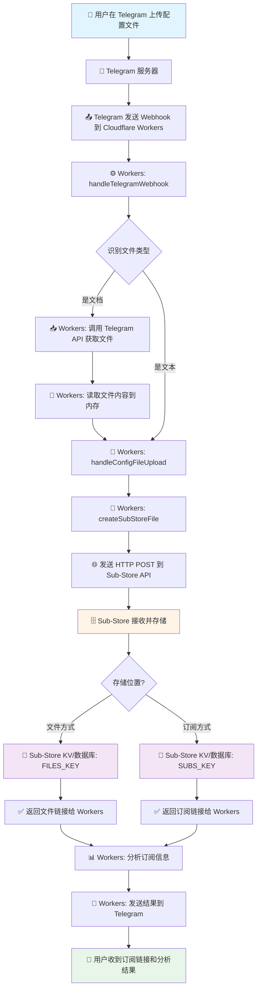

# 极光订阅助手bot

```mermaid
graph TD
    A[👤 用户在 Telegram 上传配置文件] --> B[📱 Telegram 服务器]
    B --> C[📤 Telegram 发送 Webhook 到 Cloudflare Workers]
    C --> D[⚙️ Workers: handleTelegramWebhook]
    D --> E{识别文件类型}
    E -->|是文档| F[📥 Workers: 调用 Telegram API 获取文件]
    F --> G[💾 Workers: 读取文件内容到内存]
    G --> H[🚀 Workers: handleConfigFileUpload]
    E -->|是文本| H
    H --> I[📡 Workers: createSubStoreFile]
    I --> J[🌐 发送 HTTP POST 到 Sub-Store API]
    J --> K[🗄️ Sub-Store 接收并存储]
    K --> L{存储位置?}
    L -->|文件方式| M[💾 Sub-Store KV/数据库: FILES_KEY]
    L -->|订阅方式| N[💾 Sub-Store KV/数据库: SUBS_KEY]
    M --> O[✅ 返回文件链接给 Workers]
    N --> P[✅ 返回订阅链接给 Workers]
    O --> Q[📊 Workers: 分析订阅信息]
    P --> Q
    Q --> R[📨 Workers: 发送结果到 Telegram]
    R --> S[👤 用户收到订阅链接和分析结果]
    
    style A fill:#e1f5ff
    style K fill:#fff4e6
    style M fill:#f3e5f5
    style N fill:#f3e5f5
    style S fill:#e8f5e9
```